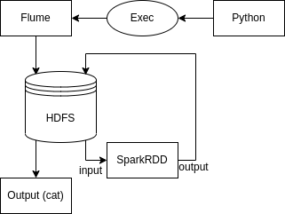

## Как запустить приложение

На хосте должен быть установлен maven.
```shell
    cd /opt
    wget https://www-eu.apache.org/dist/maven/maven-3/3.6.3/binaries/apache-maven-3.6.3-bin.tar.gz
    tar xzf apache-maven-3.6.3-bin.tar.gz
    ln -s apache-maven-3.6.3 maven
    vi /etc/profile.d/maven.sh
    С содержимым
    export M2_HOME=/opt/maven
    export PATH=${M2_HOME}/bin:${PATH}
```

Установка Docker:
```shell
docker pull zoltannz/hadoop-ubuntu:2.8.1
```

Создание и запуск контейнера Docker:
```shell
docker run --name sparkCont -p 2122:2122 -p 8020:8020 -p 8030:8030 -p 8040:8040 -p 8042:8042 -p 8088:8088 -p 9000:9000 -p 10020:10020 -p 19888:19888 -p 49707:49707 -p 50010:50010 -p 50020:50020 -p 50070:50070 -p 50075:50075 -p 50090:50090 -t zoltannz/hadoop-ubuntu:2.8.1
```

В новом терминале в папке scripts выполнить:
```shell
./startContainer.sh sparkCont
docker exec -it sparkCont bash
```
Запустить ещё один терминал для запуска Spark-приложения в папке scripts:
```shell
docker exec -it sparkCont bash
```

Скачать необходимые компоненты и запустить поток Flume в первом терминале (Flume останавливается посредством Ctrl+C, команды kill, отключения компьютера, **ОСТАНОВИТЕ ЕГО УЖЕ КТО-НИБУДЬ**):
```shell
./init.sh
./startFlume.sh &
```
Во втором терминале, для запуска Spark и обработки имеющихся данных:
```shell
./startSpark.sh
```

## Cхема взаимодействия компонентов:


